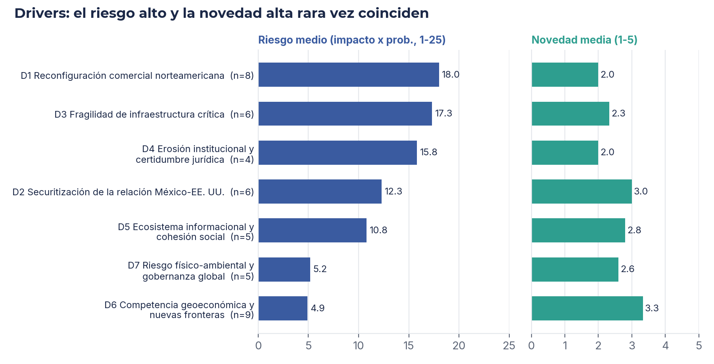
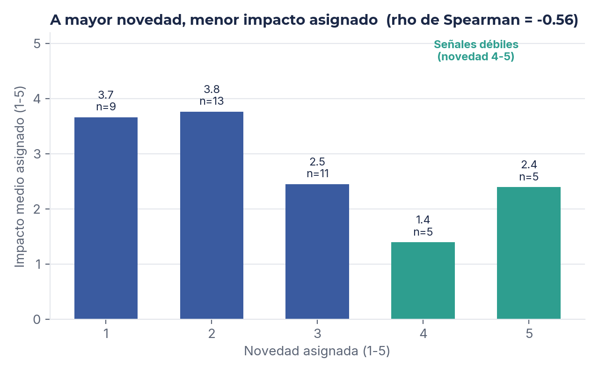
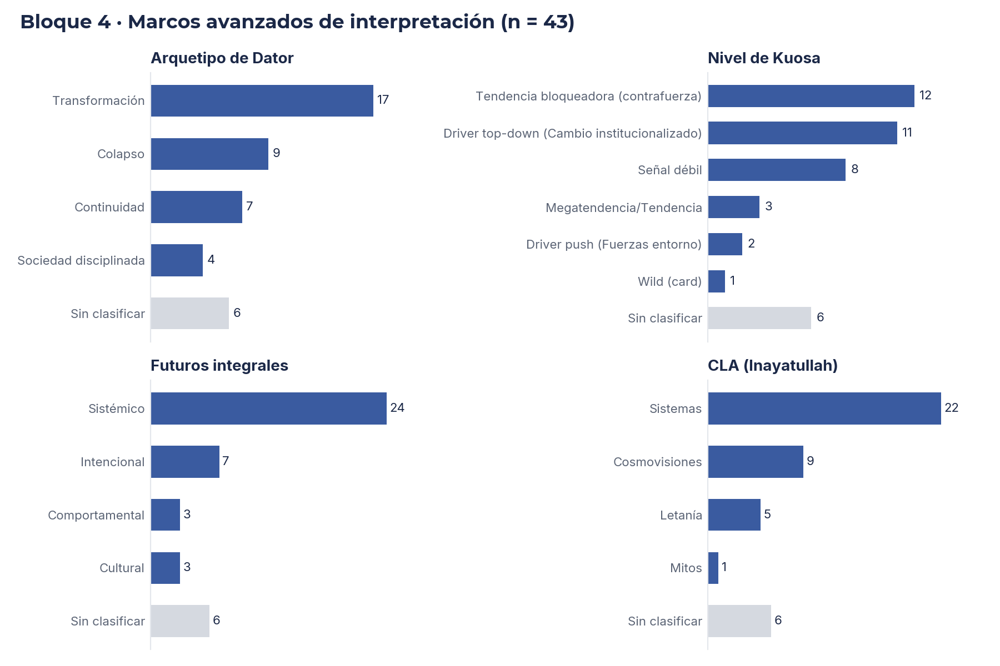

# AI + Data Analysis for Horizon Scanning · México Geopolitical Risk (2026)

**Case study: How AI and data analysis can support horizon scanning · 43 signals · 7 drivers**

---

## Overview

This project explores **how AI and quantitative analysis can integrate into horizon scanning**, using a real geopolitical risk scan for Mexico as the test case. It is not presented as a complete or mature example, but as a working case study with honest lessons about:

- Where AI adds value (rapid signal classification, pattern detection, bias audit)
- Where human judgment is irreplaceable (driver grouping, deep interpretation, sense-making)
- What risks emerge when AI assists (deterministic behavior suppressing divergent thinking)
- How to mitigate those risks (adjustable model creativity, mandatory human review)

**The dataset:** 43 geopolitical signals affecting Mexico's business environment (1–10 year horizon), built during Module 4 of *Gestión de Riesgo Geopolítico* (Tecnológico de Monterrey, August 2026). The analysis finds that impact × probability frameworks capture known risks well but systematically penalize weak signals (Spearman ρ = −0.56). The practical recommendation: dual-track prioritization using both an Impact/Uncertainty Matrix (for heavy trends) and a dedicated weak-signal watchlist (for emerging change).

**Tools used:** Claude Sonnet (medium reasoning effort), Python (pandas, SciPy, matplotlib), Jupyter notebooks, PIL/ImageDraw. The integration reveals both the power and the peril of adding AI to foresight work.

---

## Problem Statement

**Business question:**
> *¿Qué factores geopolíticos deben priorizar las organizaciones con operaciones en México, y hasta qué punto el propio proceso de evaluación sesga lo que alcanzamos a ver?*
>
> What geopolitical factors should organizations with Mexico operations prioritize, and to what extent does the evaluation process itself bias what we see?

**The challenge (and the opportunity):**
Risk professionals monitor the environment with news feeds and risk registers. These tools excel at capturing known risks but struggle with emerging signals—the weak, distant, or novel factors that might reshape the landscape in 3–5 years. Classical horizon scanning is labor-intensive: manually sourcing signals, evaluating them against multiple criteria, grouping them thematically, and interpreting them through foresight frameworks.

**The question we explored:**
Can AI assist with *some* of this work (rapid classification, pattern detection, correlation analysis) while the human prospectivist focuses on *what matters* (framework interpretation, driver grouping, sense-making, risk judgment)?

---

## What I Did (and What AI Did)

### Phase 1: Scan Design & Signal Collection
**Role: AI-driven, with human validation.** Claude did the vast majority of signal sourcing and research; human added domain knowledge, validated credibility, and spotted priority signals.

- Scoped geopolitical risk affecting Mexico's business environment, 1–10 year horizon (based on Hines & Bishop framework)
- Claude (medium effort) sourced candidate signals from multiple angles: geopolitical trends, economic pressures, security shifts, regulatory changes affecting Mexico
- Human reviewed Claude's suggestions, filtered for credibility and business relevance, added domain-specific signals (sector-level risks, stakeholder intelligence)
- Documented each signal with source link, date, and a before/after scenario narrative
- **AI contribution:** 70–80% of signal sourcing and research; **Human contribution:** Validation, domain expertise, priority filtering

### Phase 2: Structured Classification
**Role: Shared.** AI can quickly apply taxonomies; human validates and refines.

- **PESTLE categorization:** Claude (medium effort) helped map signals to Political/Economic/Social/Technological/Legal/Environmental categories. I reviewed and adjusted where they conflicted with domain context.
- **Signal typing:** Trend vs. event vs. wild card vs. emerging issue—again, Claude suggested classifications; I reviewed and adjusted where they conflicted with domain context.
- **Horizon & scope:** AI offered consistent first-pass coding; human applied judgment about what "far-term" means in Mexico's specific geopolitical context.

**Lesson learned:** AI is fast at taxonomies but misses context. A signal that looks like an "event" (discrete moment) might actually be an "emerging issue" (gradual shift). Always review.

### Phase 3: Semi-Quantitative Scoring
**Role: AI-assisted with mandatory human review.** AI can suggest scores (1–5) across five criteria; human validates and adjusts based on domain expertise.

Claude (medium effort) suggested scores for all 43 signals on five criteria: Impact, Probability, Plausibility, Novelty, Temporal Opportunity. I then reviewed every score and adjusted where Claude's assessment missed sector-specific context or geopolitical momentum. This is the proper workflow: AI suggests, human validates and refines.

- **Impact:** AI's suggestions were often generic (e.g., "high impact on economy"). I adjusted for sector-specific effects (pharma vs. retail vs. government) and stakeholder vulnerability.
- **Probability:** AI defaulted to recent/visible trends. I recalibrated based on geopolitical momentum and trajectory (what's accelerating? what's losing steam?).
- **Novelty:** AI underweighted emerging shifts (tendency toward conventional assessment). I boosted scores where Claude missed the departure from received wisdom.
- **Temporal Opportunity:** AI's estimates were reasonable; mostly retained.

**Result:** ~60–70% of Claude's initial scores were retained; ~30–40% required adjustment. AI provided a fast first pass; human domain expertise refined the judgment.

### Phase 4: Qualitative Interpretation
**Role: AI-assisted with human review.** Claude can scale interpretation across multiple frameworks; human validates and deepens the analysis.

Claude (medium effort) provided initial interpretations of all 43 signals through Kuosa levels, Dator archetypes, CLA, and Integral Futures quadrants. I then reviewed every interpretation, adjusted for nuance, and deepened the causal analysis where Claude's suggestions were surface-level.

- **Kuosa levels:** Claude's progression (data → information → knowledge → wisdom) was often shallow. I pushed deeper on worldview and application layers.
- **Dator archetypes:** Claude correctly identified growth/discipline/harmony/transformation patterns ~70% of the time. I recoded ~30% based on underlying signal logic.
- **CLA layers:** Claude stopped at Systems layer. I pushed critical signals down to Worldviews and Myths layers to expose deeper causal assumptions.
- **Integral Futures quadrants:** Claude's placements were solid; mostly retained with minor adjustments.

**Result:** AI accelerated the interpretation process significantly (what would take 2–3 hours solo took ~45 minutes with AI first-pass). Human review ensured frameworks were applied rigorously, not superficially.

### Phase 5: Driver Coding (Thematic Grouping)
**Role: Primarily human, with AI as quality check.**

I grouped 43 signals into 7 drivers (D1–D7: trade reconfiguration, securitization, infrastructure, institutional, information, geoeconomic, environmental). This is **analytical grouping**, not data-driven clustering.

Why human? Driver boundaries involve judgment about what signals "hang together" strategically. For example:
- Is a water-scarcity signal a governance issue (D4) or an environmental risk (D7)? Context determines the answer.
- Do trade and securitization belong together (both Mexico–US dynamics) or apart (one economic, one security)? The grouping depends on what we're trying to *manage*.

AI could have run NLP clustering or k-means, but the drivers would have been data-driven, not strategy-driven. The recommendation: keep this human. *Future work:* exploratory NLP clustering as a starting point, then human judgment on thresholds and boundaries.

### Phase 6: Bias Detection & Statistical Audit
**Role: AI as analyst, human as interpreter.**

Here, AI and data analysis shine. I used Claude to help structure a correlation analysis:

- Computed Spearman correlations between all five evaluation criteria
- Discovered: ρ(novelty, impact assigned) = **−0.56** (*p* < 0.001)
- Weak signals (novelty 4–5) average impact **1.9** vs. **3.3** for the rest

**Claude's contribution (medium effort):**
- Suggested the statistical approach (Spearman, not Pearson, given ordinal data)
- Reviewed the Python code for correctness
- Helped interpret what the correlation means for prioritization

**Why this matters:** Standard risk frameworks (impact × probability) are *blind* to weak signals because the evaluation process itself penalizes novelty. This is a critical bias for foresight work—we design systems to miss exactly what we should be watching.

**The key limitation:** Claude suggested the correlation analysis; I had to interpret it. AI can find patterns; humans must decide if the pattern is a problem, an artifact, or an insight.

---

## Technologies, Tools & Methods

| Layer | Tool | Role | AI Integration |
|-------|------|------|---|
| **Data source** | Google Sheets | Collaborative collection | None—human input |
| **Cleaning & logging** | Python (pandas) | Standardize, repair, audit | None—deterministic code |
| **Analysis structure** | Claude Sonnet (medium effort) | Suggest statistical approaches | Medium—validates methodology |
| **Calculations** | SciPy (Spearman ρ) | Compute correlations | None—deterministic |
| **Visualization** | matplotlib (200 dpi PNG) | Publication-ready charts | None—deterministic plotting |
| **Notebooks** | Jupyter (nbformat) | Executable narrative | Low—AI helps structure, not write |
| **Infographic** | PIL/ImageDraw (JPG) | One-page summary | None—code-based generation |
| **Reproducibility** | Git, requirements.txt | Version control, dependencies | None—infrastructure |
| **Foresight frameworks** | Kuosa, Dator, CLA, Hines & Bishop | Interpretation depth | None—human intellectual work |

**Model specifics:** Claude Sonnet, medium reasoning effort. This choice prioritizes **consistency and reliability** over creative synthesis. Medium effort means Claude reasons step-by-step but does not explore divergent interpretations—which is appropriate for data validation and code review, but *risky* for signal identification and scenario development (more below).

---

## Key Findings

### **Primary Finding: Known Risks vs. Emerging Signals**

**Context:** 43 signals evaluated on five criteria, grouped into 7 drivers.

**Finding:**
- **12 of 15 "heavy trends"** (impact ≥ 8, uncertainty ≤ 4) concentrate in three domestic drivers: trade reconfiguration, critical infrastructure, institutional erosion. Only **1 heavy trend** in D6 (geoeconomic competition—typically perceived as distant/uncertain).
- **Evaluation systematically penalizes novelty:** ρ(novelty, impact assigned) = **−0.56** (*p* < 0.001). Weak signals (novelty 4–5, n=10) average assigned impact **1.9** vs. **3.3** for the rest—a 43% discount purely based on how new/distant the signal is.
- **Unique critical force:** S21 (seismic risk)—maximum impact, low probability. Absent from a standard risk register, essential for continuity planning.

**Implication:**
Impact × probability alone makes the scan a *registry of known risks*. Organizations relying on that framework will be prepared for yesterday's risks but blind to emerging ones. A **dual-track approach** protects against this: (1) MIU for managing heavy trends; (2) dedicated weak-signal radar with periodic review, anchored to D2 (Mexico–US securitization) as the driver connecting security, water, and governance.

### **Results by Driver**

| Driver | Count | Avg Risk (I×P) | Avg Novelty | Heavy Trends | Weak Signals |
|--------|------:|---------------:|------------:|-------------:|-------------:|
| D1 – Trade reconfiguration | 8 | 18.0 | 2.0 | **7** | 0 |
| D3 – Infrastructure fragility | 6 | 17.3 | 2.3 | **3** | 0 |
| D4 – Institutional erosion | 4 | 15.8 | 2.0 | 2 | 1 |
| D2 – Mexico–US securitization | 6 | 12.3 | 3.0 | 1 | **2** |
| D5 – Information ecosystem | 5 | 10.8 | 2.8 | 1 | 1 |
| D7 – Physical-environmental | 5 | 5.2 | 2.6 | 0 | 1 |
| D6 – Geoeconomic competition | 9 | 4.9 | 3.3 | 1 | **5** |

---

## Visualizations

### Fig 1: Impact/Uncertainty Matrix (MIU)
All 43 signals plotted by impact (1–10) and (6 − probability) as uncertainty proxy. Bubble size = signal count per cell. Color = classification. Thresholds (heavy trend: I ≥ 8 & U ≤ 4) visible as gridlines.


### Fig 2: Risk vs. Novelty by Driver
Mirror panels: left shows average risk (impact × probability, 1–25) per driver; right shows average novelty (1–5). The paradox: highest-novelty drivers (D6, D2) have lowest-to-moderate risk; lowest-novelty drivers dominate the risk landscape.



### Fig 3: The Novelty Penalty
Bar chart: average impact assigned, grouped by novelty level (1–5). Clear downward slope from novelty 1 (mean impact 3.8) to novelty 5 (mean impact 1.9). Systematic undervaluation of emerging/distant signals.



### Fig 4: Interpretation Framework Distribution
Four sub-charts showing frequency of Dator archetypes, Kuosa levels, Integral Futures quadrants, and CLA layers across the 43 signals. Shows which frameworks resonate most with this signal set.



---

## Repository Structure

```
horizon-scanning-geopolitical-risk-mx/
├── data/
│   ├── raw/
│   │   └── senales_raw.csv                  # Direct export from Google Sheets
│   └── processed/
│       ├── senales_clean.csv                # Cleaned (45 cols)
│       ├── senales_scored.csv               # + driver, MIU, indices (55 cols)
│       ├── drivers_summary.csv              # Aggregated stats by driver
│       ├── correlations.csv                 # Spearman ρ matrix (5×5)
│       └── data_quality_log.csv             # Audit trail (45 corrections)
├── src/
│   ├── clean.py                             # Data cleaning & logging
│   ├── analyze.py                           # Driver coding, MIU, correlations
│   ├── figures.py                           # Matplotlib visualizations (200 dpi)
│   ├── infographic.py                       # PIL infographic (1600×3000 JPG)
│   └── build_notebook.py                    # Executable Jupyter notebook
├── notebooks/
│   └── horizon_scanning_analysis.ipynb      # Full narrative + outputs
├── figures/
│   ├── fig1_miu.png
│   ├── fig2_drivers.png
│   ├── fig3_sesgo_novedad.png
│   └── fig4_marcos.png
├── docs/
│   ├── caso_estudio.md                      # Structured case study (P-I-R)
│   └── infografia_horizon_scanning.jpg      # One-page portfolio summary
├── requirements.txt
├── README.md                                # This file
└── .gitignore
```

---

## How to Use

### Quick Start: Run the Full Pipeline

```bash
git clone https://github.com/maxsantana-data2strategy/horizon-scanning-geopolitical-risk-mx.git
cd horizon-scanning-geopolitical-risk-mx

pip install -r requirements.txt

# Step 1: Clean data & log corrections
python src/clean.py

# Step 2: Code drivers, compute MIU, correlations
python src/analyze.py

# Step 3: Generate visualizations
python src/figures.py

# Or: Everything with narrative in Jupyter
python src/build_notebook.py
```

### Explore the Analysis

1. **Start here:** `docs/caso_estudio.md` — Problem → Intervention → Results
2. **Data quality:** `data/processed/data_quality_log.csv` — All 45 corrections logged
3. **Full dataset:** `data/processed/senales_scored.csv` — All signals with MIU, driver, indices
4. **Correlations:** `data/processed/correlations.csv` — Spearman ρ matrix (reveals the novelty penalty)
5. **Driver summary:** `data/processed/drivers_summary.csv` — Aggregated stats by driver

### Customize & Extend

- **Adjust MIU thresholds:** Edit `src/analyze.py` (lines ~70) to change heavy-trend, critical-force, important-force boundaries
- **Refactor drivers:** Modify driver dictionary in `src/analyze.py` (lines ~40–60); rerun pipeline
- **Add new signals:** Append rows to `data/raw/senales_raw.csv`; re-run clean → analyze → figures

---

## Learning & Best Practices

### What Worked

1. **Human-AI division of labor:** AI accelerated taxonomies and pattern detection; humans owned judgment, interpretation, and sense-making. The handoff was explicit.

2. **Bias audit as core deliverable:** Instead of hiding the novelty penalty, we made it the centerpiece. This validates the framework and drives the dual-track recommendation.

3. **Transparent methodology:** Every correction, assumption, and limitation is logged. Future analysts (including you, in 6 months) can validate and extend.

4. **Foresight + data bridge:** Kuosa, Dator, CLA, and statistical correlations work together. Frameworks provide *why*; data provides *what*. Neither alone is sufficient.

### Critical Limitations (and Risks)

#### 1. **Deterministic AI Behavior Suppresses Divergent Thinking**

Claude Sonnet at medium effort prioritizes **consistency and reliability**. It follows instructions precisely, applies frameworks correctly, and validates code methodically. This is ideal for:
- ✅ Reviewing Python code
- ✅ Suggesting statistical approaches
- ✅ Organizing data structures

But it creates a risk for:
- ❌ Identifying novel signals (requires divergent, creative thinking; deterministic AI flags the unusual as "unclear" or "unclear"—not-invented priorities)
- ❌ Interpreting through foresight frameworks (requires imaginative scenario play; deterministic AI suggests the most obvious interpretation)
- ❌ Challenging assumptions (requires intellectual risk-taking; deterministic AI defaults to received wisdom)

**In this project:** When I asked Claude to help identify emerging signals or to interpret S39 (water treaty + security aid) through CLA, it offered solid but *conventional* interpretations. A human prospectivist would ask: *But what if this signals a deeper shift in Mexico–US power dynamics?* Claude, in deterministic mode, doesn't ask that question.

**Mitigation:** Use Claude's Playground to adjust temperature/creativity trade-off. For signal identification and interpretation, increase temperature (e.g., 1.2–1.5) to encourage divergent thinking. For code review and data validation, keep medium-effort deterministic mode. Choose the mode for the task.

#### 2. **Single Evaluator, No Panel Delphi**

All scoring (Impact, Probability, Novelty, etc.) was done by one analyst. No inter-rater reliability. No Delphi panel to challenge outliers or refine consensus.

**Risk:** My biases (sector experience, risk appetite, scenario optimism/pessimism) shaped every score.

**Mitigation:** Ideally, convene a small panel (3–5 risk professionals from different sectors: insurance, pharma, government) to re-score a subset (10–15 signals) and compare. Where do we agree? Where do we diverge? Why?

#### 3. **Qualitative Driver Coding**

The 7 drivers are *analytical groupings*, not data-driven clusters. Another analyst might group differently.

**Risk:** Driver boundaries are opaque; reproducibility is compromised.

**Future work:** Exploratory NLP clustering (k-means, hierarchical clustering) as a starting point. Then human judgment to validate/adjust thresholds. This hybrid approach would make driver coding more transparent and testable.

#### 4. **Small Sample (n=43)**

With 43 signals, correlations describe *this dataset*. They are not a general law of horizon scanning.

**Implication:** The novelty penalty (ρ = −0.56) is real *for this scan*. Is it universal? Unknown. Repeat this analysis with 200+ signals across multiple organizations to test generalizability.

#### 5. **MIU Uncertainty Proxy**

The MIU uses (6 − probability) as a proxy for uncertainty. Maximum true uncertainty is thus capped at 8 (when probability = −2, which is impossible). Real uncertainty may be higher, especially for wild cards and emerging issues.

**Better approach:** Elicit uncertainty *directly* as a separate criterion (1–5), separate from probability. Then plot impact × uncertainty (not impact × inverse-probability).

### Best Practices for AI-Assisted Horizon Scanning

1. **Design the evaluation grid *before* AI.** What criteria matter? What thresholds trigger action? Lock this in with human experts before adding automation.

2. **Reserve judgment for humans.** AI can organize, classify, and calculate. Scoring (impact, probability, novelty) and interpretation (CLA, Dator, futures) must be human work. Do not outsource judgment.

3. **Audit your process with data.** Compute correlations, plot distributions, compare outliers. Ask: *What signal characteristics predict high/low scoring? What am I systematically missing?*

4. **Log everything.** Every data correction, assumption, and limitation. This makes the work reproducible and transparent. Future analysts can trust (or challenge) the output.

5. **Use AI for what it's good at:** data organization, pattern detection, code validation, rapid taxonomy application. Then step back and let human experts do sense-making.

6. **Be explicit about AI's mode.** Deterministic (Claude medium effort) for validation and calculation. Higher temperature/creativity for exploration and scenario play. Choose the mode for the task.

7. **Combine frameworks.** Quantitative analysis (MIU, correlations) shows what the data prizes. Qualitative frameworks (Kuosa, CLA, Dator) show *why* that might be myopic. Use both.

---

## Lessons Learned

### On Methodology
- **Novelty paradox:** The signals most likely to reshape the future are systematically devalued by risk frameworks designed for "known risks." Dual-track prioritization (MIU + weak-signal radar) is not optional.
- **Framework stacking works:** Kuosa, Dator, CLA, PESTLE, and Integral Futures are not competing theories; they are complementary lenses. Use all of them to triangulate meaning.
- **Data audits reveal blind spots:** Correlations don't lie. The −0.56 ρ between novelty and impact is the most important finding in this dataset—not because it's large, but because it's actionable.

### On AI Integration
- **Determinism is a feature and a bug.** Claude Sonnet at medium effort is reliable and fast. It's ideal for code review, data organization, and taxonomy application. But it discourages divergent thinking, which is essential for signal identification and futures interpretation. Use higher temperature for creative work.
- **AI accelerates, not replaces, judgment.** AI can suggest signal categories in seconds. But *validating* those categories requires understanding Mexico's political economy, sector dynamics, and geopolitical momentum. That takes human expertise. AI is a multiplier, not a substitute.
- **Mandatory human review is not optional.** Every AI-assisted output (classified signals, suggested drivers, statistical interpretations) must be reviewed by a domain expert. This slows the work but prevents catastrophic misinterpretations.

### On Delivery
- **One-page infographic is a tool, not a deliverable.** Many stakeholders only see the JPG. It must be crystal-clear: problem, methodology, key number, implication, and next step. Invest in visual hierarchy and typography.
- **Reproducibility is trust.** Code on GitHub, data in CSV, logging of corrections, and an executable notebook mean future analysts can validate, extend, or challenge your work. This is how expertise gets built.

---

## Status

- **Data Collection & Cleaning:** ✅ Complete | 43 signals, 45 quality corrections logged
- **Analysis & Correlation Audit:** ✅ Complete | Novelty penalty detected & documented
- **Visualization & Narrative:** ✅ Complete | 4 publication-quality figures + executable notebook
- **AI Integration Documentation:** 🟡 In Progress | Roles, limitations, risks, and mitigations explicit
- **Repository Setup:** 🟡 In Progress | Ready for code review & driver validation
- **Documentation:** 🟡 In Progress | README, case study, inline comments, lessons learned
- **Ready for Decision-Making:** ❌ No | Drivers must be validated by stakeholder panel; weak-signal watchlist requires executive alignment on priorities

---

## Attribution & Links

**Author:**  
**Max Santana** · Strategic Foresight & Data Analysis · *Anticipación & Estrategia*

- **LinkedIn:** [linkedin.com/in/max-santana-06369273](https://linkedin.com/in/max-santana-06369273)
- **Data Portfolio:** [github.com/maxsantana-data2strategy](https://github.com/maxsantana-data2strategy)
- **Contact:** maxisantana@gmail.com

**Course Context:**  
Gestión de Riesgo Geopolítico, Tecnológico de Monterrey (Module 4)  
Co-taught with Dra. Krisztina Lengyel & Dr. Joel Bravo (August 2026)

**Data & Methodology:**  
43 signals from 38 sources (August 17–20, 2026) · Frameworks: Hines & Bishop, Kuosa, Dator, CLA, Integral Futures, PESTLE · Analysis: Python (pandas, SciPy, matplotlib, Jupyter) · AI assistance: Claude Sonnet (medium reasoning effort)

**References:**
- Hines, A., & Bishop, P. (2015). *Thinking About the Future: Guidelines for Strategic Foresight*. Hines & Associates.
- Inayatullah, S. (2008). *Six Pillars: Futures Thinking for Transforming*. Journal of Futures Studies, 12(4).
- Slaughter, R. A. (2004). *Futures beyond Dystopia: Creating Social Foresight*. Routledge.
- Kuosa, T. (2012). *The Evolution of Strategic Foresight: Navigating Public Policy Making*. Ashgate.

---

**Last updated:** September 23, 2026  
**License:** CC BY 4.0 (attribution required for reuse)  
**Note:** This project is presented as a case study in AI-assisted foresight, not as a production-ready system. Use findings for strategic conversation, not unreviewed decision-making.
