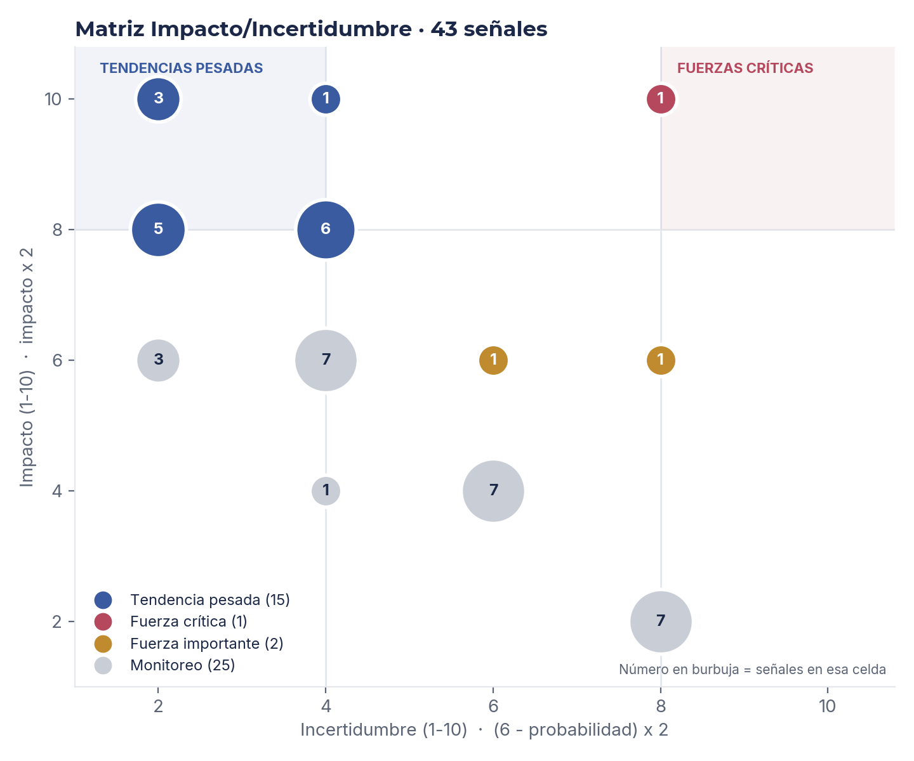

# Escaneo de Horizontes · Riesgo geopolítico para México (2026)

**43 señales · 7 drivers · 5 criterios de evaluación · 4 marcos de interpretación**

Escaneo de horizontes (*horizon scanning*) sobre los factores geopolíticos que pueden reconfigurar el entorno de negocio en México en un horizonte de 1 a 10 años. La base de señales se construyó como material del Módulo 4 del curso de **Gestión de Riesgo Geopolítico** (Tecnológico de Monterrey, agosto de 2026), que imparto junto con la Dra. Krisztina Lengyel. Este repositorio la lleva un paso más allá: la limpia, la hace reproducible y analiza qué prioriza la evaluación y qué deja fuera.

> **English summary.** A structured horizon scan of 43 geopolitical signals relevant to Mexico (2026), each classified with PESTLE, scored on five semi-quantitative criteria, and interpreted using Kuosa, Dator, Integral Futures and CLA. The analysis finds that 12 of the 15 "heavy trends" concentrate in three domestic drivers, and that the scoring itself penalises novelty (Spearman ρ = −0.56 between novelty and impact). The recommendation is a dual-track prioritisation: an impact/uncertainty matrix for heavy trends, plus a separate weak-signal watchlist.

---

## Pregunta de negocio

**¿Qué factores geopolíticos deben priorizar las organizaciones con operaciones en México, y hasta qué punto el propio proceso de evaluación sesga lo que alcanzamos a ver?**

## Metodología

| Etapa | Qué se hizo | Referencia |
|---|---|---|
| 1. Encuadre | Alcance: riesgo geopolítico con incidencia en México; horizonte 1 a 10 años | Hines & Bishop, *Thinking About the Future* |
| 2. Escaneo | 43 señales de 38 fuentes (prensa, think tanks, gobiernos, revistas académicas), capturadas del 17 al 20 de agosto de 2026 | Plantilla de escaneo del curso |
| 3. Clasificación | PESTLE, tipo de hallazgo, horizonte, alcance, efecto sobre el escenario | Hines & Bishop |
| 4. Evaluación | Impacto, probabilidad, plausibilidad, novedad y oportunidad temporal (escala 1-5) | Evaluación semicuantitativa |
| 5. Interpretación | Sombreros (Mad Hatter), niveles de Kuosa, cuadrantes de Futuros Integrales, FODA, arquetipos de Dator, CLA | Kuosa; Dator; Slaughter; Inayatullah |
| 6. Codificación | Agrupación de las señales en 7 drivers | Codificación analítica |
| 7. Priorización | Matriz Impacto/Incertidumbre con los umbrales del curso; índice de riesgo; índice de señal débil | MIU; radar de futuros |
| 8. Diagnóstico | Correlaciones de Spearman entre criterios para detectar sesgos de evaluación | — |

**Reglas de la MIU (escala 1-10):** Impacto₁₀ = impacto × 2; Incertidumbre₁₀ = (6 − probabilidad) × 2.
Tendencia pesada: I ≥ 8 y U ≤ 4 · Fuerza crítica: I ≥ 8 y U ≥ 8 · Fuerza importante: I ≥ 6 y U ≥ 6 · Monitoreo: el resto.

## Hallazgo principal

| Contexto | Hallazgo | Implicación |
|---|---|---|
| 43 señales evaluadas con cinco criterios y clasificadas en 7 drivers. | **12 de las 15 tendencias pesadas** están en tres drivers domésticos: comercio norteamericano, infraestructura crítica y certidumbre jurídica. Además, **la evaluación penaliza la novedad**: ρ(novedad, impacto) = −0.56 (p < 0.001), y las 10 señales débiles promedian un impacto de 1.9, frente a 3.3 del resto. | Priorizar solo por impacto × probabilidad convierte el escaneo en un registro de riesgos ya conocidos. Hace falta una **doble vía**: MIU para gestionar las tendencias pesadas y un **radar de señales débiles** con revisión periódica. La securitización de la relación México-EE. UU. (D2) es el driver que conecta ambas vías. |

### Resultados por driver

| Driver | n | Riesgo medio (I×P) | Novedad media | Tendencias pesadas | Señales débiles |
|---|---:|---:|---:|---:|---:|
| D1 Reconfiguración comercial norteamericana | 8 | 18.0 | 2.0 | 7 | 0 |
| D3 Fragilidad de infraestructura crítica | 6 | 17.3 | 2.3 | 3 | 0 |
| D4 Erosión institucional y certidumbre jurídica | 4 | 15.8 | 2.0 | 2 | 1 |
| D2 Securitización de la relación México-EE. UU. | 6 | 12.3 | 3.0 | 1 | 2 |
| D5 Ecosistema informacional y cohesión social | 5 | 10.8 | 2.8 | 1 | 1 |
| D7 Riesgo físico-ambiental y gobernanza global | 5 | 5.2 | 2.6 | 0 | 1 |
| D6 Competencia geoeconómica y nuevas fronteras | 9 | 4.9 | 3.3 | 1 | 5 |

### Otras lecturas

- **Driver bisagra (D2).** Concentra 2 de las 3 señales con novedad y probabilidad ≥ 4: **S39**, el Congreso de EE. UU. condiciona la ayuda en seguridad al cumplimiento del Tratado de Aguas de 1944, y **S40**, la solicitud de extradición del gobernador de Sinaloa. La agenda de seguridad empieza a condicionar la política hídrica y la gobernanza subnacional.
- **Única fuerza crítica:** S21, el riesgo sísmico en México (impacto máximo, probabilidad baja). Es el caso típico de un evento que no aparece en un registro de riesgos, pero sí en un plan de continuidad.
- **Profundidad interpretativa.** De las 37 señales clasificadas con CLA, 22 se quedan en el nivel *Sistemas* y solo una llega a *Mitos*. El siguiente paso analítico es bajar a las capas de cosmovisión y mito.
- **Sesgo de amenaza.** De las 35 señales clasificadas en FODA, 23 son amenazas y solo 8 oportunidades.

## Visualizaciones

| | |
|---|---|
|  |  |
|  |  |

## Calidad de datos

`src/clean.py` registra cada corrección en `data/processed/data_quality_log.csv`:

- **S38** no existe en la base (la numeración llega a S44, pero hay 43 señales).
- **S39** tenía celdas desplazadas; se reubicaron y los *stakeholders* se reconstruyeron a partir de la descripción.
- **S14 a S17** tenían fechas de publicación con año 1905 (error de formato de Sheets) y **S37** solo registraba el año; quedaron como `NaT`.
- **S39 a S44** (agregadas el 20 de agosto) no tienen los marcos del Bloque 4, y S27 y S35 tienen "?" en FODA. Se tratan como "Sin clasificar".

## Limitaciones

- La evaluación es de un solo analista; no hay un panel Delphi ni una medición de acuerdo entre evaluadores.
- La codificación en drivers es cualitativa. Otra persona podría agrupar las señales de otra forma.
- Con n = 43, las correlaciones describen esta base; no son una ley general del escaneo.
- La MIU usa (6 − probabilidad) como proxy de incertidumbre, así que la incertidumbre máxima alcanzable es 8.

## Estructura

```
├── data/
│   ├── raw/senales_raw.csv            # exportación directa del Google Sheet
│   └── processed/
│       ├── senales_clean.csv
│       ├── senales_scored.csv         # + driver, MIU, índices
│       ├── drivers_summary.csv
│       ├── correlations.csv
│       └── data_quality_log.csv
├── src/
│   ├── clean.py                       # limpieza y bitácora de calidad
│   ├── analyze.py                     # drivers, MIU, índices, correlaciones
│   ├── figures.py                     # visualizaciones
│   └── build_notebook.py              # genera y ejecuta el notebook
├── notebooks/horizon_scanning_analysis.ipynb
├── figures/
└── docs/                              # caso de estudio e infografía
```

## Reproducir

```bash
pip install -r requirements.txt
python src/clean.py && python src/analyze.py && python src/figures.py
# o bien, todo el flujo con narrativa:
python src/build_notebook.py
```

## Autor

**Max Santana** · Prospectiva estratégica y análisis de datos · *Anticipación & Estrategia*
[LinkedIn](https://linkedin.com/in/max-santana-06369273) · [Portafolio](https://github.com/maxsantana-data2strategy)
